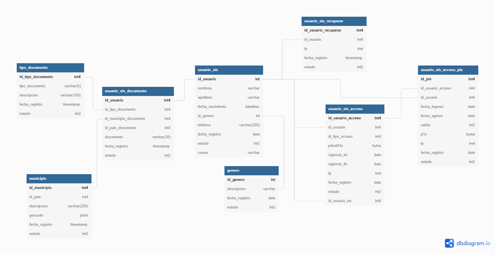

# Dependencias Usadas
- npm i express morgan sequelize pg pg-hstore  dotenv
- npm i sequelize-cli nodemon -D

# Modelo De Datos

## BD POSTGRES 

- Base Nombre: sis_analytics
- Esquema: public
- 172.30.0.27
- Tablas: usuario_sis, usuario_sis_acceso, usuario_sis_documento, usuario_sis_acceso_pin, usuario_sis_grupo, usuario_sis_recuperar, usuario_sis_trabajador

- Consultas de prueba
```
select * from usuario_sis where id_usuario = 849
select * from usuario_sis_acceso where id_usuario = 849
select * from usuario_sis_documento where id_usuario = 849
select * from usuario_sis_acceso_pin where id_usuario = 849
select * from usuario_sis_grupo where id_usuario = 849
select * from usuario_sis_cliente where id_usuario = 849
select * from usuario_sis_recuperar where id_usuario = 849
select * from usuario_sis_trabajador where id_usuario = 849
```
- Modelo Base



- Json Test Para Crear Usuario
```
{
    "nombres":"edgar carlos mauricio",
    "apellidos":"quintero romero",
    "fecha_nacimiento":"1979-08-18 00:00:00.000 -0500",
    "id_genero":1,
    "telefono":3193779313,
    "correo":"pepe@gmail.com",
    "estado":1
}
```


# DOCKERFILE 

```
sudo docker build -t app_pythonedgar .
sudo docker tag app_pythonedgar sisedgar/app_pythonedgar:v2

docker images
En otra ventana de terminal     sudo docker stats

sudo docker run --rm -p 5000:5000 sisedgar/app_pythonedgar:v2

Mantenerlo corriendo en segundo plano
sudo docker run -d --rm -p 5000:5000 sisedgar/app_pythonedgar:v2

Mantenerlo corriendo en segundo plano pero a los 5000 segundos se cierra
sudo docker run -d -p 5000:5000 sisedgar/app_pythonedgar:v2 sleep 5000

Para convertir una imagen en un contenedor hacemos esto:
sudo docker run -it sisedgar/app_pythonedgar:v2

Ejemplo de editar variables de entorno de un contenedor
docker run -e "APP=PandoraFMS" -e "VER=740" alpine echo "$APP $VER"

Ahora vamos a borrar una imagen asi:
sudo docker rmi images eefc0cb3ada9

En caso de querer saber cuantos contenedores tenemos activos debemos ejecutar este comando:
sudo docker ps

Pero si lo que queremos es ver todos los contenedores activos e inactivos debemos ejecutar:
sudo docker ps -a

Para detener un contenedor que aun este corriendo en docker debemos ejecutar este comando:
sudo docker stop eefc0cb3ada9

De igual forma para arrancar un contenedor detenido debemos ejecutar:
sudo docker start eefc0cb3ada9

Si queremos acceder a nuestro contenedor debemos ejecutar este comando:
sudo docker attach eefc0cb3ada9

Para eliminar un contenedor debemos ejecutar.
sudo docker rm eefc0cb3ada9

```